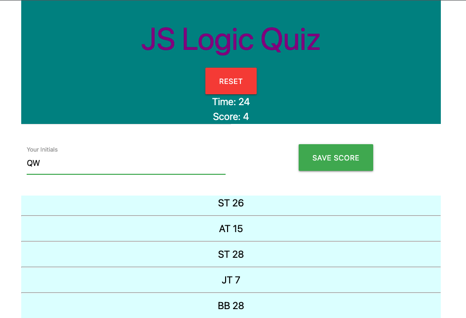
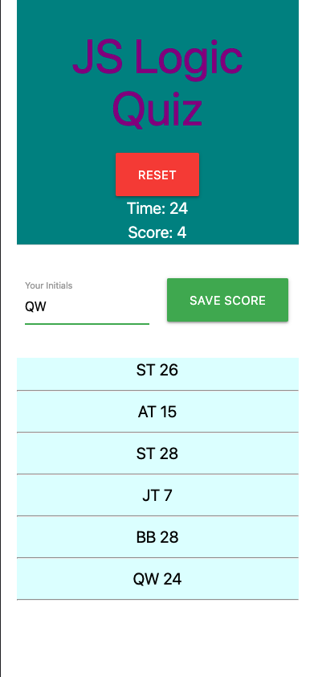

# CodeQuiz
A coding quiz that relies on dynamically updated HTML and CSS, powered
by JavaScript. The user is given 30 seconds to answer each of the
questions correctly. If they chose incorrectly, 10 seconds are removed
from the available time. Given the user does not select the correct
answer in the given time, then the game will be over. At any time
during game play the user can restart the game. There is also a
"See Scores" button on the main page that allows the user to see
scores without entering the game. 

[Deployed Site](https://st12345678910.github.io/CodeQuiz/)

